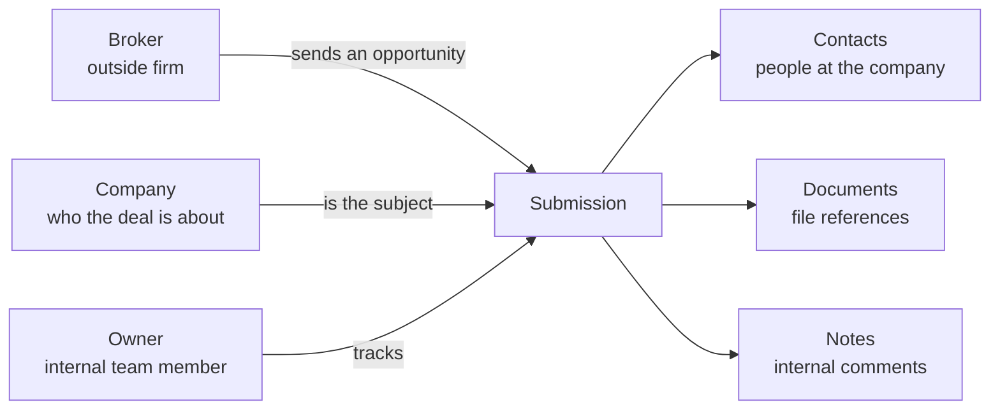
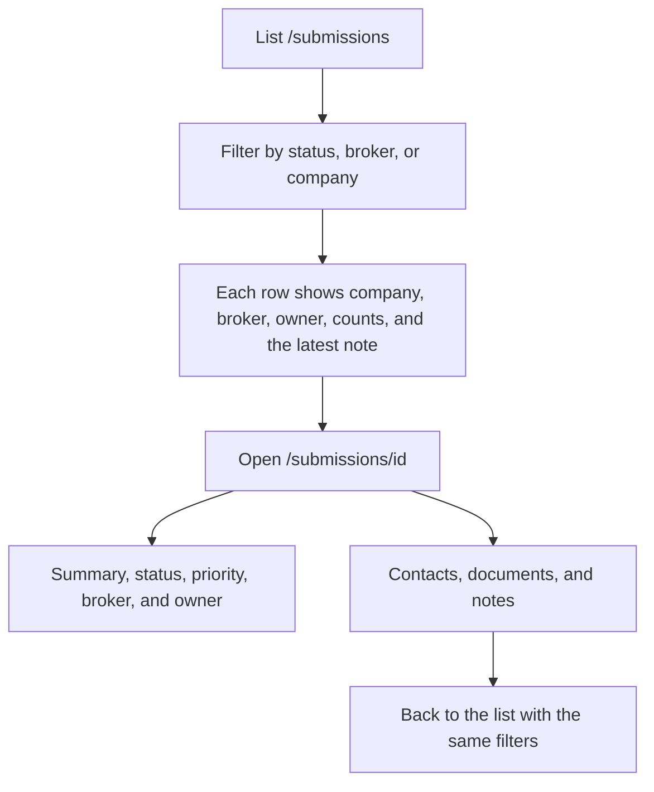

# Submission flow

A broker is the outside firm that sends an opportunity. The company is who the deal is about. The owner is the internal team member tracking that one submission. Contacts, documents, and notes belong to the submission, not to the broker. The app reviews records that already exist.

An operator starts on the list, narrows it, then opens one record. The back link returns to the same filters.

A submission's status is `new`, `in_review`, `closed`, or `lost`. Priority is `high`, `medium`, or `low`.
